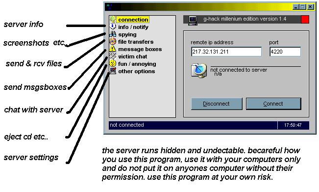



## g\-Hack Pro \- remote admin tool

### Description

see screenshot for all features and details!

use at own risk

do not connect to a server unless you have permission from the owner of that computer!

lots of features and very easy to use! great layout
 
### More Info
 

             |
---                |---
**Submitted On**   |2001-08-21 17:50:08
**By**             |[Chris Wilson UK](https://github.com/Planet-Source-Code/PSCIndex/blob/master/ByAuthor/chris-wilson-uk.md)
**Level**          |Intermediate
**User Rating**    |4.6 (64 globes from 14 users)
**Compatibility**  |VB 6\.0
**Category**       |[Complete Applications](https://github.com/Planet-Source-Code/PSCIndex/blob/master/ByCategory/complete-applications__1-27.md)
**World**          |[Visual Basic](https://github.com/Planet-Source-Code/PSCIndex/blob/master/ByWorld/visual-basic.md)
**Archive File**   |[g\-Hack Pro250538212001\.zip](https://github.com/Planet-Source-Code/chris-wilson-uk-g-hack-pro-remote-admin-tool__1-26447/archive/master.zip)

